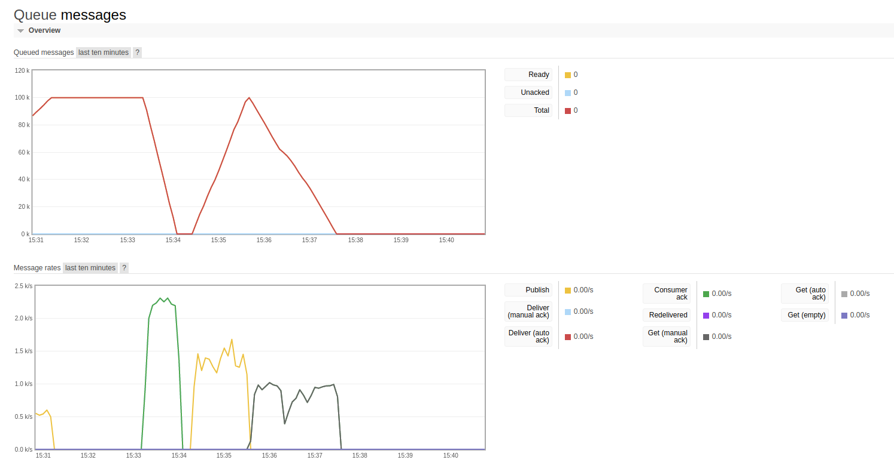

# Demo RabbitMQ Async

## Why

Symfony Messenger allow to send and consume message from RabbitMQ, but they currently only allow to use GET method in place of PULL method.

## How to test

- Start the project
```
docker-compose up -d
docker exec -it demo-rabbitmq demo-rabbitmq_php_1 composer install
```
- Go into container  ```docker exec -it demo-rabbitmq_php_1 bash```
- Generate a chunk of message with ```bin/console app:create-sleep-message 100000```
- Consume messages with ```bin/console messenger:consume```
- Replace Worker by our custom worker to use pull method and relaunch the commande to compare

### Use the consume method

In vendor/symfony/messenger/Command/ConsumeMessagesCommand.php, replace
```
$worker = new Worker($receivers, $bus, $this->eventDispatcher, $this->logger);
```
by
```
$worker = new \App\Messenger\Worker($receivers, $bus, $this->eventDispatcher, $this->logger);
```

## Mesures

- First green line : With pull method (> x2 !)
- Second gray line : With get (default) method

